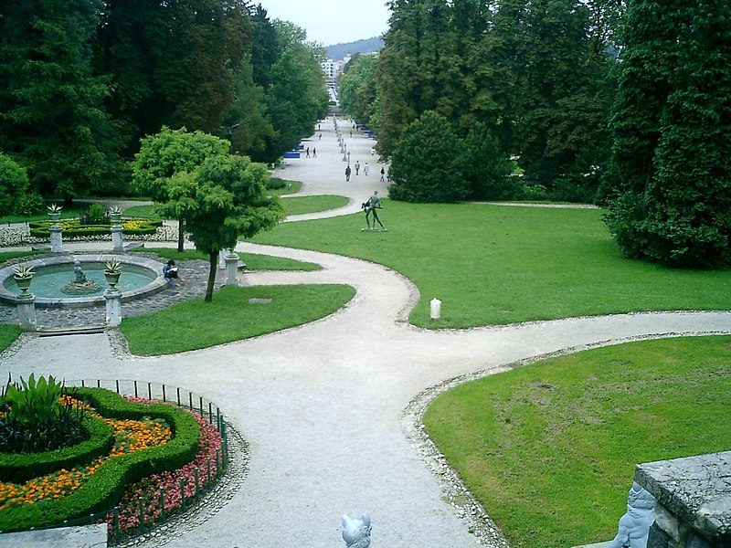
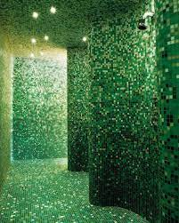
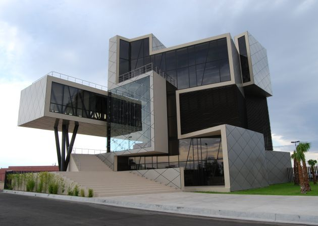
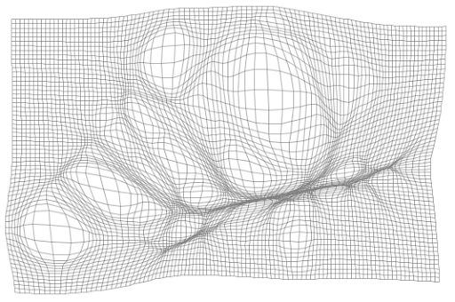
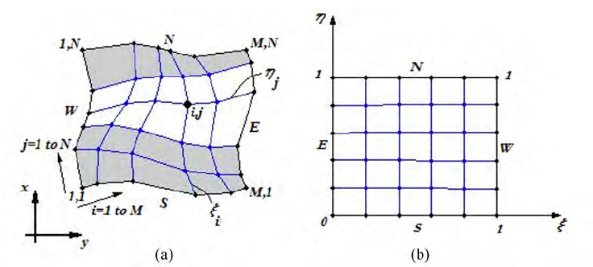

# Methodology of Implementation of Somniloquy
- The functionalities of the game engine and how to implement them needs consideration and planning. Some of the key functions of the game require unthought developed strategies.

## Meta-Application Effects
- Fancy unveiling of the game window as it launches

## Shaders
- Per-material shading (grass, metal, concrete, fiber, plastic, glass, dirt, water, oil, leaves, flowers, etc.)
- Per-style shading (realistic, pixel art, collage, lineart, crayon, Van Gogh, etc.)

## The World
- **World** is a storage of world metadata and its **Sectors**. Stores multiple Sectors of similar theme - basically group of sectors that would be in the same page of Yume Wiki.

- **Sector** is what would be the unit of Screen Transition. Contains multiple **Portions**.

- **Portion** is a local piece of the Sector, discretely stored so that the Sector can be shuffled like a puzzle piece. It is a collection of **Layers**. Additional portioning inside a Portion would be available in the editor to ease Sector divisions. Stores 3D transformation data. Transitioning alpha values of layers located in same space would be understood as 4th dimension-shifting as a mixture of ideas of FEZ and Aversion. 

- **Layer** is the smallest unit of the World. It is a 3D data representation of space (I'm thinking of a 1. chunked voxel map like in Minecraft 2. aided by additional Object Layer which stores objects and their orientations placed on top of the voxel map). By applying it's parent Portion's transformations, distortion of space will occur (Cityscape - buildings, roads fold like in movie Inception, impossible geometries like in Monumental Valley, shortening or lengthening, rotation, complex distortions of map for puzzle solutions, gravity direction, time flow speed, and environmental effects.) Also stores per-voxel event data in the voxel map. 

- **Voxel** is simply the 3D version of a 2D Tile of my previous implementation of Somniloquy in Monogame, designed to follow OOP rules, storing tile information like collision data and others.

- **Object** is a class type for objects that would either not fit in a voxel or be needed to be placed not in a grid-like manner, such as graffiti textures on walls, flowers, trees, foliage, statues, poles, traffic signs and et cetera.

## World Editor
- World Creation Window (input forms for metadata, UI for adding Sectors)
- Sector View Window (create, move and place portions inside the sector)
- Portion Editor (create, move and place layers inside the portion, edit transformation metadata, additional portioning, etc.)
- Layer Editor (create, move and place tiles inside the layer, place layer events, various functionalities that would easen world construction like fill area, copy, pattern placing, etc.)
- Tile/Object Editor (mesh, material assigning, collision, etc.)
- Texture Editor (color wheel, brush, fill, line, polygons, gradient, etc.) 

# Methodology Regarding Layer Construction with Transformations
- Use a hierarchical system of layers where each layer can have its own set of transformations. This allows for the creation of complex shapes and environments by combining and transforming multiple simpler layers.

- Layer transforms allow for complex manipulations of the world by applying various transformations to individual layers or combinations of layers. These transformations can include translation, rotation, scaling, shearing, and others, providing a powerful tool for creating unique and dynamic environments.

- Transformation Types:
    - Translation: Moving layers in any direction.
    - Rotation: Rotating layers around a specific axis.
    - Scaling: Increasing or decreasing the size of layers.
    - Shearing: Skewing layers to create a slanted effect.
    - Curvature: Applying curvature to layers for effects like bending or folding.
    - Time Flow: Manipulating the flow of time within specific layers.
    - Gravity Direction: Changing the direction of gravity within layers.
    Layer Blending: Transitioning alpha values of layers to create - smooth blending effects.

### Example Scenarios

Garden Path (First Image)
- Base Layer: A flat terrain layer without transformations.
- Path Layer: A secondary layer with high transformations to create the winding paths. Apply translation and rotation transformations to create curves.
- Final Transformation: Apply a vertical ground curvature transformation to both the base and path layers to achieve the final effect.

Curved Green Walls (Second Image)
- Floor and Ceiling Layers: Flat layers with no transformations applied.
- Wall Layer: A secondary layer with transformations applied to create the curved walls. Use rotation and translation transformations to achieve the curvature.

Modern Architecture (Third  Image)
- Base Layer: A flat layer for the ground.
- Tilted Floors Layer: Multiple layers with linear transformations applied to create the tilted floors. Each layer can be independently transformed to achieve the complex architectural design.

Implementation Steps

- Define Base Layer: Create the base layer using voxel maps or a flat grid as the foundation.

- Add Transformed Layers: Add secondary layers with specific transformations to create paths, walls, or other structures. Use the layer editor to apply translation, rotation, scaling, and shearing transformations.

- Combine Layers: Combine the base and transformed layers, ensuring proper coordinate mapping and alignment. Use hierarchical transformations where necessary to maintain consistency.

- Apply Final Transformations: Apply any final transformations to the combined layers to achieve the overall desired effect, such as ground curvature or complex architectural forms.

- Test and Iterate: Use the playtesting mode to ensure the visual and functional integrity of the combined layers. Adjust transformations and layer compositions as needed to achieve the desired result. 

## On Transformations

